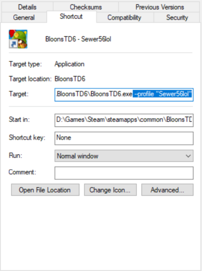

# Multi User for Bloons TD 6

## Introduction

Multi User is a mod for Bloons TD 6 that allows you to run multiple copies of Bloons TD6 at once.

## Download

You can find the download for the mod in the [Releases Section on GitHub](https://github.com/Sewer56/BloonsTD6.Mod.MultiUser//releases/latest).  
Simply extract the DLL to your `Mods` directory.  

## Warning

⚠️ RISK OF DATA LOSS.

Before using this mod, consider creating a backup of your save data contained in:
- `Steam/userdata/<user-id>/960090`  

## Usage

In order to use an alternative profile:  
- Create a game shortcut.  
- Add desired flags (see below).  
- Launch game.  

In this example, adding `--profile Sewer56 --save Sewer56` will make the game use an alternative account associated with the name `Sewer56`.  When you boot into the game you'll be prompted to log-in. When you use the same shortcut in the future, you will be automatically logged into that account with its own separate save file.  

### List of Available Flags

`--profile ProfileName`: Specifies an alternative account to use.  
`--save SaveName`: Specifies an alternative save file to use.  

It is recommended to specify both `--profile` and `--save`; unless your intention is to share the same save file between multiple accounts (co-op with self).  

Note: *This mod will likely get you hacker pooled and (by design) cannot be used to circumvent the hacker pool.*  

## Features List

✅ indicates a feature is implemented.  
⚠️ indicates a feature is not yet complete.  
❌ indicates a feature is not yet implemented.   

- ✅ Multiple Instances of Game At Once.  
- ✅ Test Co-Op Mods without Another PC.  
- ✅ Run Multiple In-Game Profiles Concurrently.  

## Building

All source code is contained inside the `source` folder.  

### First Time Setup

- Install [.NET 6.0 SDK or newer](https://dotnet.microsoft.com/en-us/download).  

Compiled game mod should appear in the `Mods` directory in your game folder.

### Building from Command Line
- Open a terminal (cmd/powershell/bash) and navigate to the project folder.
- Run `dotnet build -c Release`.

### Building from Visual Studio
- Install Visual Studio 2022 (or Newer).
- Open `BloonsTD6.Mod.MultiUser.sln`.

### Copy on Build

In order to make it so your mod gets copied to the `Mods` folder on build, you need to set the `BLOONSTD6_PATH` Environment Variable.

- For most users simply double clicking `SetEnvironmentVariable.ps1` should be sufficient.
- Alternatively, run the script manually from PowerShell `.\SetEnvironmentVariable.ps1 -Path "D:\Games\BloonsTD6"`.  

## Updating Game & Library Versions 

Rather than hardcoding game paths, this project builds using `Reference Assemblies`.  
Reference Assemblies are DLLs which contain API implementations only; i.e. the bare minimum to build the mod.  

This makes it so the mod can be compiled without having a local copy of Bloons installed; such as in a `GitHub Actions` environment.

- Install `MelonLoader` and `BTD6 Mod Helper`, run Bloons TD6 at least once.
- Execute the `MakeReferenceAssemblies.ps1` script in PowerShell.
    - If needed, you can specify a custom game path as a parameter, e.g. `.\MakeReferenceAssemblies.ps1 -Path D:\Games\Steam\steamapps\common\BloonsTD6`
